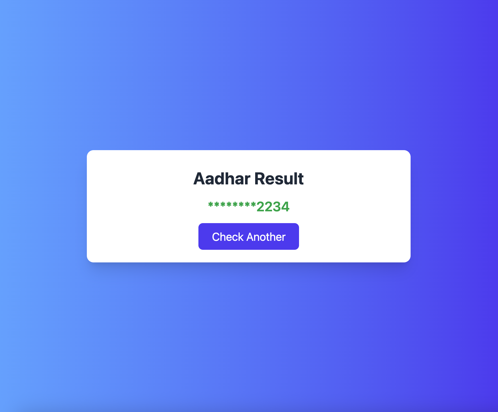

# Aadhar Card Checker

A sleek and responsive React app to validate Aadhaar numbers in real time using UIDAI format rules, with polished UI/UX and modern frontend best practices.

---

## Submission Details

- **GitHub Repository**: [aadhar-card-checker](https://github.com/sharmaHarshit2000/aadhar-card-checker)  
- **Live Demo**: [View on Vercel](https://aadhar-card-checker.vercel.app)

[](https://github.com/sharmaHarshit2000/aadhar-card-checker)
[](https://aadhar-card-checker.vercel.app)


---

## Screenshots (SS)

> Add your app screenshots here after deploying or running locally. Replace the image paths below with yours.

- Home page (input + hero)
  
  
  
- Valid result (masked output)
  
  

- Error/invalid state (toast + validation)
  
  

---

## Features

- **Auto-formatting**: Users type digits and see the format `1234-5678-9123` in real time.
- **Strict Validation**: Uses UIDAI-compliant regex — must be 12 digits and start with 2–9.
- **Mock API Integration**: Simulates Aadhaar verification via API with random success/failure for realistic UX.
- **Loader & Toasts**: Displays spinner during verification and toast messages for success or error.
- **Masked Result**: Masks first 8 digits for privacy (`**** **** 1234`) on a result screen.
- **Accessibility (a11y)**: Keyboard-friendly, `aria-label` for input, focus ring styles.
- **Responsive Design**: Looks great on mobile, tablet, and desktop using TailwindCSS.
- **Routing**: Uses React Router for smooth transitions between pages.

---

## Tech Stack

| Technology       | Purpose                          |
|------------------|----------------------------------|
| React.js         | Frontend framework               |
| React Router     | Page routing (`Home` & `Result`) |
| TailwindCSS      | Utility-first styling            |
| react-hot-toast  | Toast notifications              |
| fetch API (mock) | Simulates backend call           |
| Vercel / Netlify | Deployment (live demo)           |

---

## Getting Started

### Prerequisites

- Node.js (v14+)
- npm or yarn

### Installation & Running Locally

```bash
git clone https://github.com/sharmaHarshit2000/aadhar-card-checker.git
cd aadhar-card-checker
npm install      # or: yarn install
npm start        # or: yarn start
# App runs at http://localhost:3000
```

---

## Project Structure

```
aadhar-card-checker/
├── src/
│   ├── components/
│   │   ├── InputForm.jsx     ← handles input, formatting, validation, API & navigation
│   │   └── Loader.jsx        ← spinner shown during mock API call
│   ├── pages/
│   │   ├── Home.jsx          ← hero + input form
│   │   └── Result.jsx        ← shows masked result and “check again” button
│   ├── App.jsx               ← routes and toast container
│   └── index.css             ← Tailwind + custom animation & toast styles
├── public/
├── package.json
└── README.md
```

---

## How It Works

1. User enters Aadhaar number — auto-formatted in `XXXX-XXXX-XXXX`.
2. On **Check**, the app:
   - Validates format using regex.
   - Calls mock API (e.g., `jsonplaceholder.typicode.com`) with a loader.
   - Randomly simulates success or failure to mimic real-world behavior.
3. On **success** — navigates to result page with masked Aadhaar (`**** **** 1234`).  
   On **failure** — shows error toast.


---

## Submission Details

- **GitHub Repo**: https://github.com/sharmaHarshit2000/aadhar-card-checker
- **Live Demo**: https://your-deployment-url.vercel.app

---

## Notes

- This project validates **format only** and **does not** verify real Aadhaar data.
- Do **not** send or store actual Aadhaar numbers in any backend or logs.
